# Section 5 — Deployment evidence

Figures referenced by the traceability matrix in Section 2.

**Every image below is a placeholder.** Replace each file in `figures/` with the
real capture, keeping the same filename, and the references resolve without any
edit to this document or to the matrix.

Browser captures must be taken **from the deployed instance with the address bar
visible** — the address is what makes the image deployment evidence rather than a
screenshot of a local development server. The instance permits inbound port 80
from specific `/32` addresses only, so capture from a whitelisted network.

Suggested order, so the data each figure needs exists when you reach it: register
an applicant (5.1–5.3, 5.8–5.10), approve it as administrator (5.4–5.6), sign in
as the approved member (5.7, 5.11–5.12), then the remaining terminal and console
captures (5.13–5.17).

---

### Figure 5.1

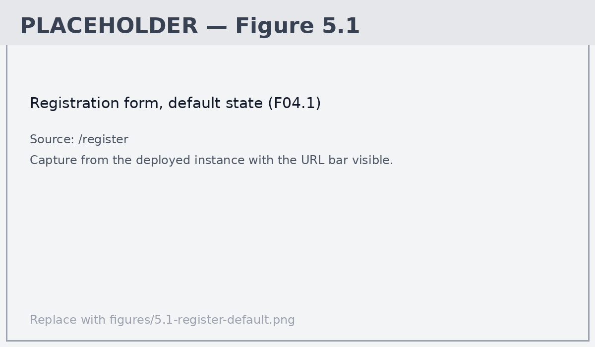

**Figure 5.1.** Registration form in its default state.

| | |
|---|---|
| Source | `http://<instance-ip>/register` |
| Evidences | R1 |
| File | `figures/5.1-register-default.png` |
| Status | **Placeholder — not yet captured** |

---

### Figure 5.2

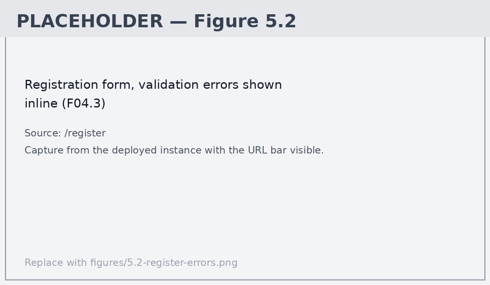

**Figure 5.2.** Registration form rejecting invalid input, with field-level messages shown inline.

| | |
|---|---|
| Source | `http://<instance-ip>/register` |
| Evidences | R1, NFR6 |
| File | `figures/5.2-register-errors.png` |
| Status | **Placeholder — not yet captured** |

---

### Figure 5.3

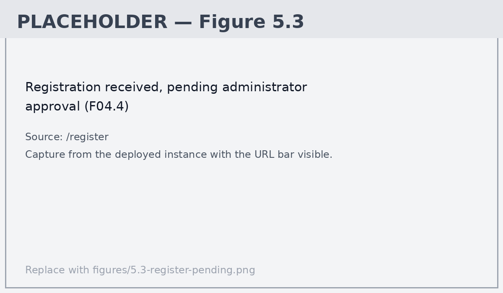

**Figure 5.3.** Confirmation that the registration was received and is awaiting administrator approval.

| | |
|---|---|
| Source | `http://<instance-ip>/register` |
| Evidences | R1 |
| File | `figures/5.3-register-pending.png` |
| Status | **Placeholder — not yet captured** |

---

### Figure 5.4

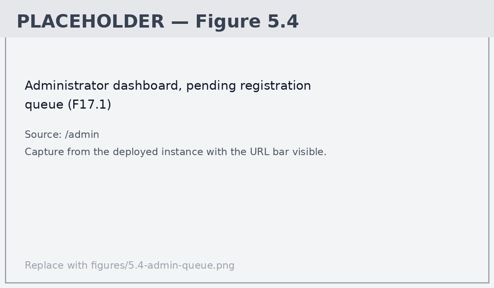

**Figure 5.4.** Administrator dashboard listing pending registrations, oldest first.

| | |
|---|---|
| Source | `http://<instance-ip>/admin` |
| Evidences | R2 |
| File | `figures/5.4-admin-queue.png` |
| Status | **Placeholder — not yet captured** |

---

### Figure 5.5

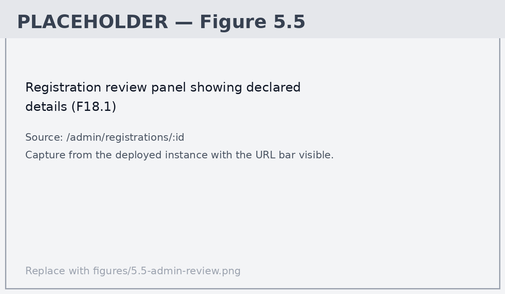

**Figure 5.5.** Registration review panel showing the applicant's declared association details.

| | |
|---|---|
| Source | `http://<instance-ip>/admin/registrations/:id` |
| Evidences | R2 |
| File | `figures/5.5-admin-review.png` |
| Status | **Placeholder — not yet captured** |

---

### Figure 5.6

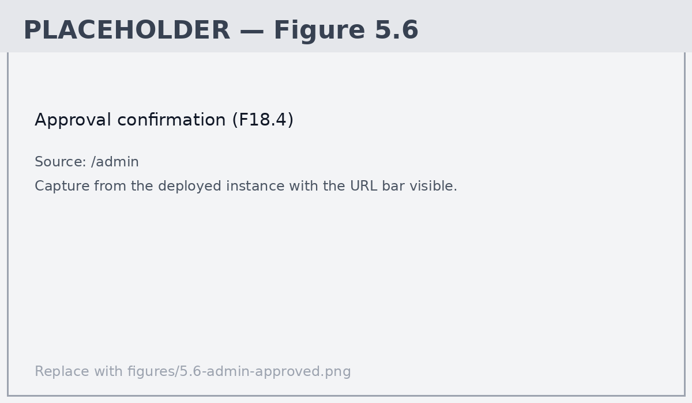

**Figure 5.6.** Confirmation after approving a registration; the applicant leaves the queue.

| | |
|---|---|
| Source | `http://<instance-ip>/admin` |
| Evidences | R2 |
| File | `figures/5.6-admin-approved.png` |
| Status | **Placeholder — not yet captured** |

---

### Figure 5.7

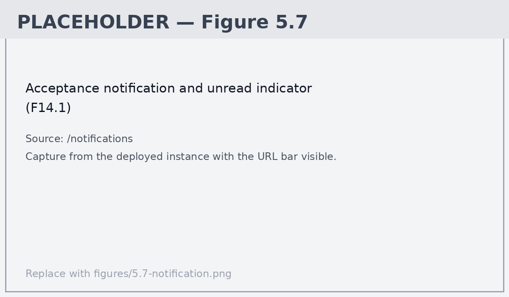

**Figure 5.7.** Acceptance notification with the unread indicator in the header.

| | |
|---|---|
| Source | `http://<instance-ip>/notifications` |
| Evidences | R3 |
| File | `figures/5.7-notification.png` |
| Status | **Placeholder — not yet captured** |

---

### Figure 5.8

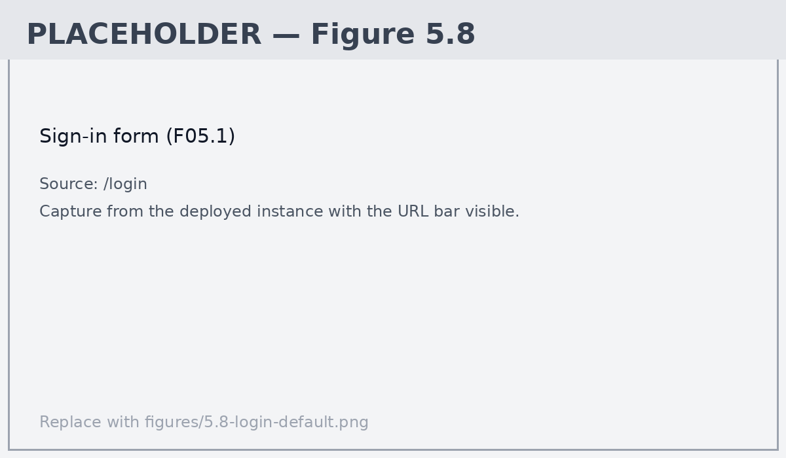

**Figure 5.8.** Sign-in form.

| | |
|---|---|
| Source | `http://<instance-ip>/login` |
| Evidences | R4 |
| File | `figures/5.8-login-default.png` |
| Status | **Placeholder — not yet captured** |

---

### Figure 5.9

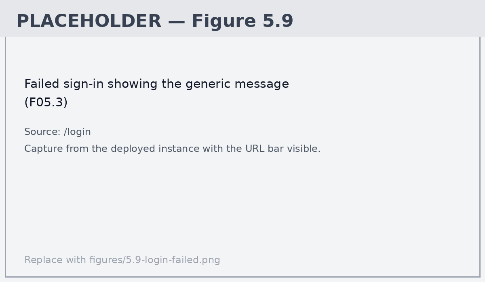

**Figure 5.9.** Failed sign-in. The message is identical for a wrong password and an unknown address, so the form cannot be used to test whether an account exists.

| | |
|---|---|
| Source | `http://<instance-ip>/login` |
| Evidences | R4, NFR2 |
| File | `figures/5.9-login-failed.png` |
| Status | **Placeholder — not yet captured** |

---

### Figure 5.10

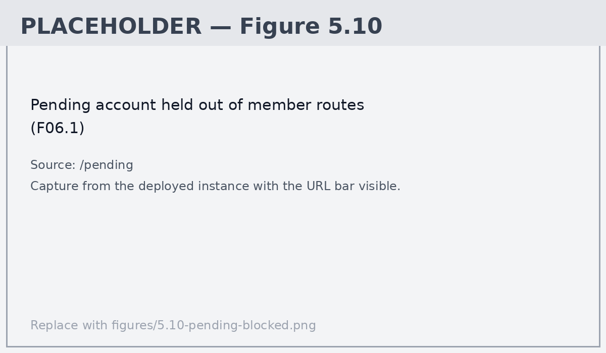

**Figure 5.10.** A pending account signed in and held on the pending-approval screen, refused by every member route.

| | |
|---|---|
| Source | `http://<instance-ip>/pending` |
| Evidences | R4, NFR2 |
| File | `figures/5.10-pending-blocked.png` |
| Status | **Placeholder — not yet captured** |

---

### Figure 5.11

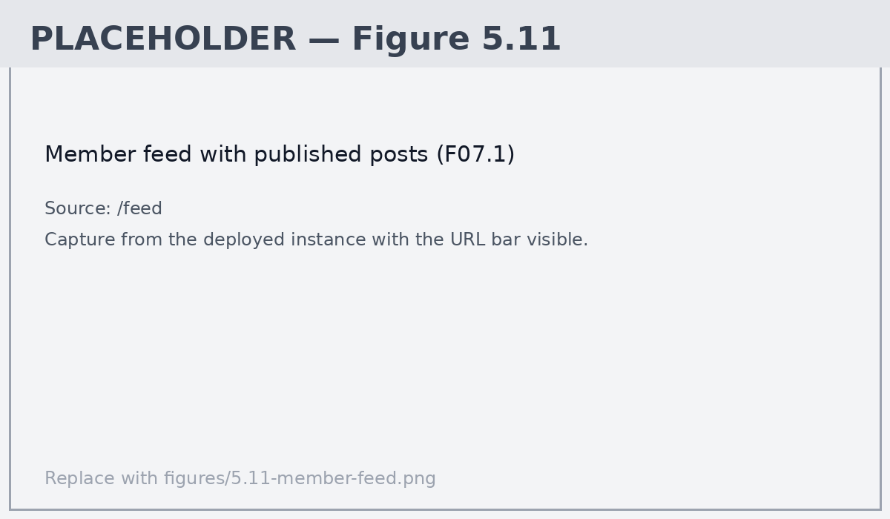

**Figure 5.11.** Member feed showing published posts with author and role.

| | |
|---|---|
| Source | `http://<instance-ip>/feed` |
| Evidences | R5 |
| File | `figures/5.11-member-feed.png` |
| Status | **Placeholder — not yet captured** |

---

### Figure 5.12

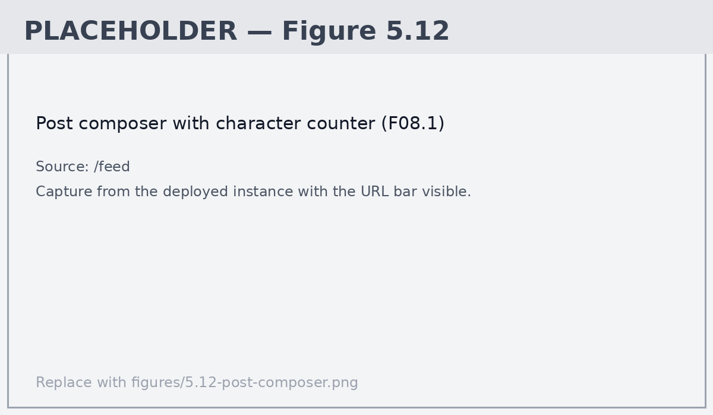

**Figure 5.12.** Post composer with the live character counter.

| | |
|---|---|
| Source | `http://<instance-ip>/feed` |
| Evidences | R5 |
| File | `figures/5.12-post-composer.png` |
| Status | **Placeholder — not yet captured** |

---

### Figure 5.13

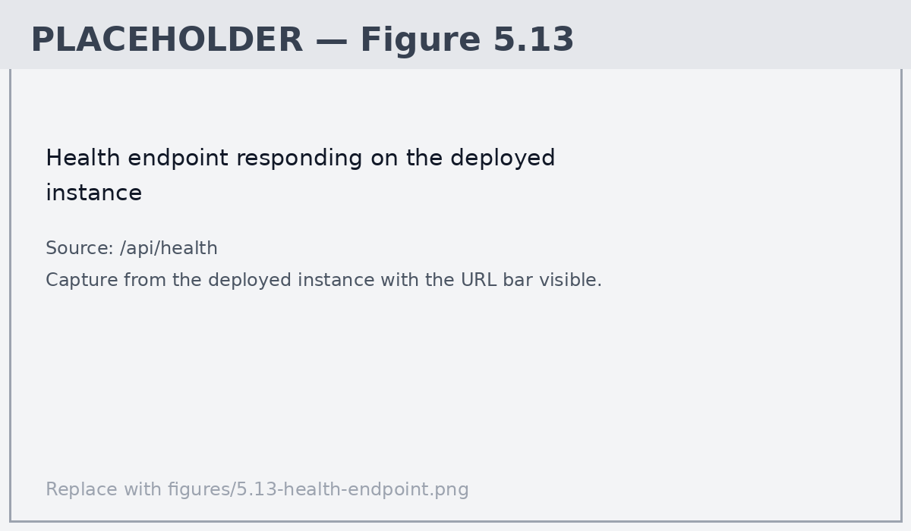

**Figure 5.13.** Health endpoint responding on the deployed instance, with the address visible.

| | |
|---|---|
| Source | `http://<instance-ip>/api/health` |
| Evidences | R14 |
| File | `figures/5.13-health-endpoint.png` |
| Status | **Placeholder — not yet captured** |

---

### Figure 5.14

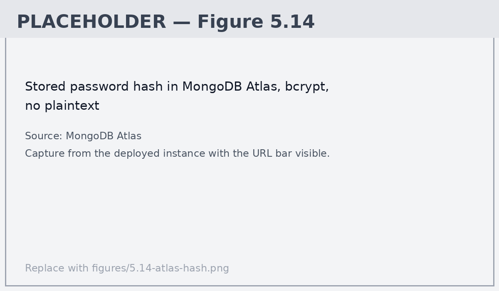

**Figure 5.14.** Stored user document in MongoDB Atlas. `passwordHash` is a bcrypt hash and the submitted password appears nowhere.

| | |
|---|---|
| Source | MongoDB Atlas — Browse Collections |
| Evidences | NFR1 |
| File | `figures/5.14-atlas-hash.png` |
| Status | **Placeholder — not yet captured** |

---

### Figure 5.15

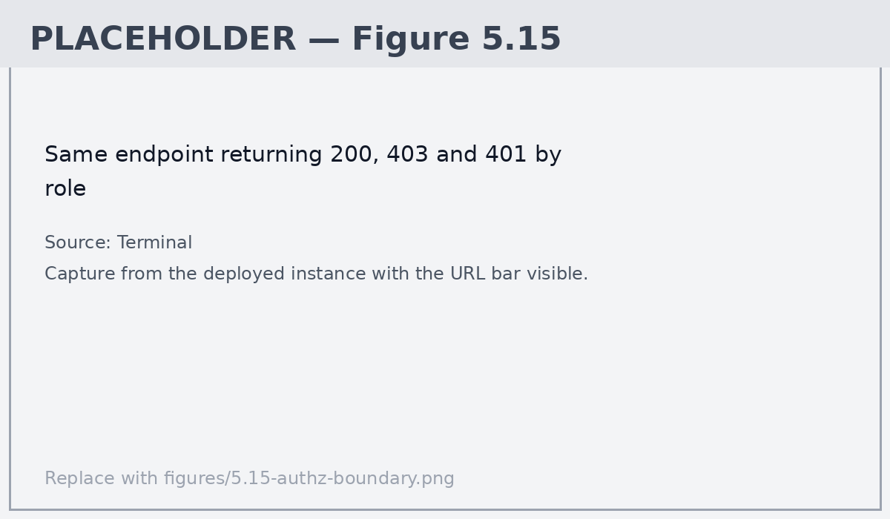

**Figure 5.15.** The same administrator endpoint returning 200 to an administrator, 403 to an approved member and 401 unauthenticated.

| | |
|---|---|
| Source | Terminal, against the deployed instance |
| Evidences | NFR2 |
| File | `figures/5.15-authz-boundary.png` |
| Status | **Placeholder — not yet captured** |

---

### Figure 5.16

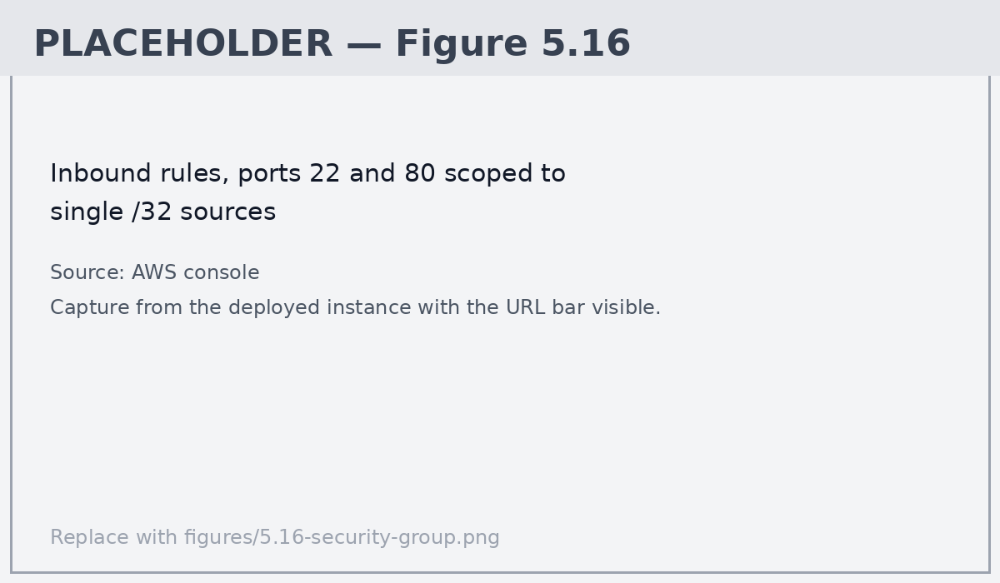

**Figure 5.16.** Inbound security group rules. Ports 22 and 80 are scoped to single `/32` sources; there is no wildcard rule.

| | |
|---|---|
| Source | AWS console — EC2 security groups |
| Evidences | NFR4 |
| File | `figures/5.16-security-group.png` |
| Status | **Placeholder — not yet captured** |

---

### Figure 5.17

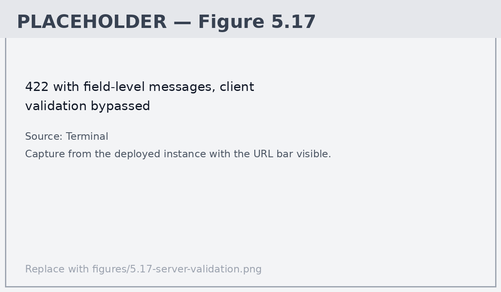

**Figure 5.17.** A 422 with field-level messages, produced by calling the API directly so client-side validation is bypassed.

| | |
|---|---|
| Source | Terminal, against the deployed instance |
| Evidences | NFR6 |
| File | `figures/5.17-server-validation.png` |
| Status | **Placeholder — not yet captured** |

---
